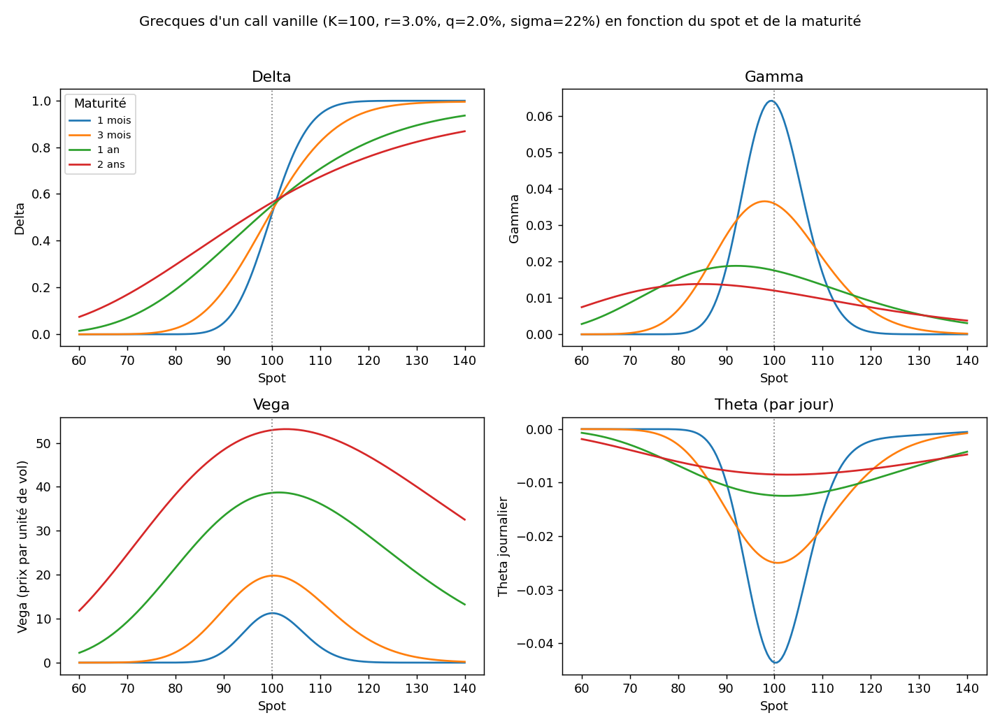
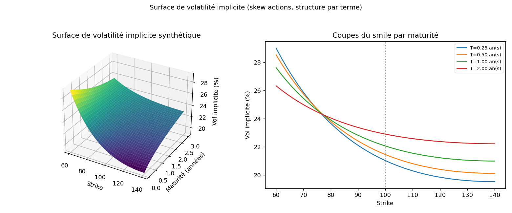
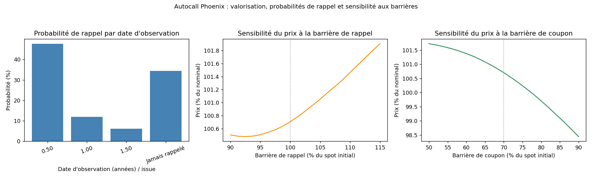
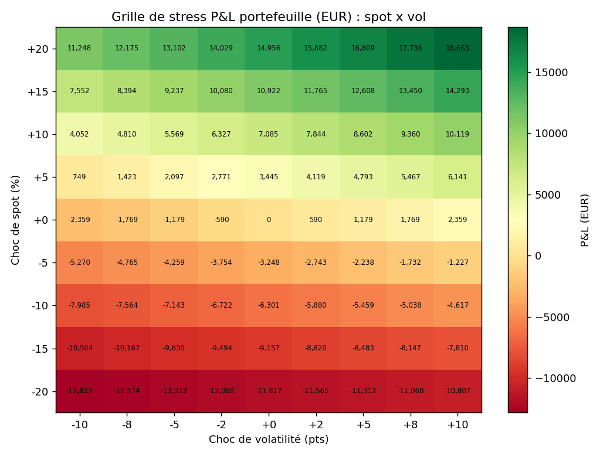
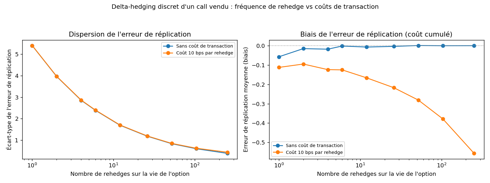

# structrisk -- Pricing d'options et de produits structurés

**Bibliothèque Python de valorisation et de suivi du risque de produits structurés et d'options** : Black-Scholes-Merton et jeu complet de Grecques (ordre 1 et supérieur), arbre binomial CRR, volatilité implicite, moteur Monte Carlo vectorisé, payoffs autocall/reverse convertible/bonus cappé/note à capital protégé/worst-of, agrégation de portefeuille et simulation de couverture delta.


## Pourquoi ce projet

En société de gestion, le suivi du risque d'un book d'options et de produits structurés repose sur trois briques : **valoriser** correctement chaque instrument (y compris les structures à barrière, qui n'ont pas de formule fermée), **décomposer** ce risque en Grecques exploitables au quotidien (delta-hedge, budget de vega, coût de rehedge), et **agréger** ces Grecques au niveau du portefeuille pour piloter les limites d'exposition. Ce projet reconstruit ces trois briques de zéro, avec :

- des Grecques d'ordre supérieur (vanna, volga, charm...) rarement implémentées dans des exemples pédagogiques mais couramment utilisées pour le risque de smile et le rehedge dynamique ;
- des produits structurés valorisés par Monte Carlo avec réduction de variance et Grecques stables par bump-and-revalue à nombres aléatoires communs (indispensable dès qu'un payoff est discontinu, comme un autocall) ;
- une couche d'agrégation de portefeuille (delta-équivalent en euros, gamma/vega par choc, grille de stress spot x vol) directement transposable à un reporting de suivi de portefeuilles modèles.

C'est directement le périmètre d'un poste de suivi de produits structurés et de compréhension des Grecques en gestion des risques de marché : le code ici n'est pas un pricer boîte noire, chaque formule est documentée avec son usage opérationnel.

## Grecques implémentées

| Grecque | Formule (call, sauf mention) | Usage opérationnel en gestion des risques |
|---|---|---|
| **Delta** | `e^{-qT} N(d1)` | Quantité de sous-jacent pour être couvert au premier ordre ; exposition delta-équivalente d'une position optionnelle |
| **Gamma** | `e^{-qT} phi(d1) / (S sigma sqrt(T))` | Vitesse de dégradation du delta ; pilote la fréquence de rehedge nécessaire |
| **Vega** | `S e^{-qT} phi(d1) sqrt(T)` | Exposition au niveau de vol implicite (P&L par point de vol), risque clé d'un book d'options/structures |
| **Theta** | `-S e^{-qT} phi(d1) sigma / (2 sqrt(T)) - r K e^{-rT} N(d2) + q S e^{-qT} N(d1)` | P&L de portage attendu au seul passage du temps, à spot/vol inchangés |
| **Rho** | `K T e^{-rT} N(d2)` | Risque de taux, secondaire pour des options courtes mais significatif pour les structures longues (brique obligataire d'une note à capital protégé) |
| **Vanna** | `-e^{-qT} phi(d1) d2 / sigma` | `d(delta)/d(sigma)` : dérive du delta quand la vol bouge ; risque de corrélation spot-vol sur un book delta-hedge, stratégies de risk reversal |
| **Volga (vomma)** | `Vega * d1 * d2 / sigma` | `d(vega)/d(sigma)` : convexité vol-de-vol, arbitrage straddle vs strangle |
| **Charm** | `-q e^{-qT} N(d1) + e^{-qT} phi(d1) * [(r-q)/(sigma sqrt(T)) - d2/(2T)]` | Rehedge delta nécessaire au seul passage du temps, clé avant un week-end ou une coupure de marché |
| **Speed** | `-Gamma/S * (d1/(sigma sqrt(T)) + 1)` | `d(gamma)/dS` : risque de « gamma qui explose » près d'une barrière ou d'un strike proche de la monnaie |
| **Zomma** | `Gamma * (d1*d2 - 1) / sigma` | `d(gamma)/d(sigma)` : déformation du coût de rehedge quand la vol implicite bouge |
| **Color** | `-Gamma * (q + d1*Dd1 + 1/(2T))` | `d(gamma)/dT` : usure du gamma au fil du temps, budget de rehedge près de l'échéance |
| **Veta** | `Vega * (-q - d1*Dd1 + 1/(2T))` | `d(vega)/dT` : dégradation de l'exposition vega dans le temps, arbitrage de roll d'une couverture de vol |

Toutes les Grecques d'ordre supérieur sont dérivées analytiquement (pas recopiées d'une table) et vérifiées par différence finie dans les tests. Pour l'arbre binomial CRR et les produits structurés Monte Carlo, delta/gamma/theta sont extraits par différence finie à deux niveaux ou bump-and-revalue avec nombres aléatoires communs (CRN), afin de rester stables même pour des payoffs discontinus (barrières).

## Produits structurés supportés

| Produit | Fiche résumée |
|---|---|
| **Autocall Phoenix** | Rappel automatique si performance >= barrière de rappel à une date d'observation ; coupon conditionnel à effet mémoire si performance >= barrière de coupon (rattrapage des coupons manqués) ; à l'échéance sans rappel, remboursement intégral si performance >= barrière de protection, sinon perte en capital au prorata |
| **Reverse Convertible** | Coupon fixe garanti versé à l'échéance quelle que soit la performance ; remboursement intégral du nominal si la barrière n'est jamais franchie à la baisse (barrière continue ou seulement à l'échéance), sinon remboursement au prorata de la performance finale |
| **Certificat Bonus Cappé** | Aucun coupon ; si la barrière n'est jamais touchée, l'investisseur reçoit le meilleur entre le niveau bonus garanti et la performance réelle, plafonné au cap ; si la barrière est touchée, exposition intégrale à la baisse (plafonnée au cap) |
| **Note à capital protégé** | `protection_level + participation_rate * clip(perf - strike_level, 0, cap_level - strike_level)` ; se réplique exactement par un zéro-coupon + un call-spread, ce qui permet une validation croisée analytique du prix Monte Carlo |
| **Option worst-of sur panier** | Call/put dont le sous-jacent est la performance du plus mauvais actif d'un panier corrélé ; sensible non seulement aux volatilités individuelles mais fortement à la corrélation (une baisse de corrélation dégrade le prix d'un call worst-of) |

## Quickstart

```python
from structrisk.blackscholes import all_greeks

greeks = all_greeks(spot=100, strike=105, maturity=1.0, rate=0.03, dividend=0.02, vol=0.22, option_type="call")
print(greeks["delta"], greeks["vanna"])
```

```bash
pip install -r requirements.txt
pip install -e .
python -m pytest tests -q
```

## Résultats

### 1. Grecques en fonction du spot et de la maturité



Pour un call ATM (K=100) à 1 an (r=3%, q=2%, sigma=22%) : delta=0,5506, gamma=0,01756, vega=38,635, theta/jour=-0,0124. Le gamma ATM à 1 mois (0,06395) vaut 5,32x le gamma ATM à 2 ans (0,01203) -- illustration directe de la concentration du risque de rehedge près de l'échéance pour une option à la monnaie.

### 2. Surface de volatilité implicite



La paramétrisation synthétique (skew négatif, structure par terme qui s'aplatit) donne une vol ATM interpolée de 22,06% à 1 an. Le skew à 1 an vaut 1,27 point de vol entre K=90 (22,82%) et K=110 (21,55%), cohérent avec le smile actions usuel (protection à la baisse plus chère que l'upside).

### 3. Valorisation d'un Autocall Phoenix



Autocall Phoenix (4 observations semestrielles, coupon 4%, barrières 100%/70%/60%, 200 000 trajectoires) : prix = 100,71 (IC95% [100,64, 100,77]). Probabilité de rappel dès la première observation (6 mois) = 47,59%, probabilité de survie sans rappel = 34,38%, dont 22,71% de probabilité de perte en capital si le produit survit jusqu'à l'échéance. Le prix passe de 100,51 (barrière de rappel à 95%) à 101,05 (barrière à 105%) : abaisser la barrière de rappel accélère le remboursement (moins de coupons potentiels) mais réduit le risque de capital, l'effet net ici est légèrement négatif sur le prix.

### 4. Agrégation des Grecques d'un portefeuille mixte



Portefeuille (call long, put court, note à capital protégé, bonus cappé, tous sur le même sous-jacent) : exposition delta-équivalente de 66 931 EUR, gamma P&L de +3,92 EUR pour un choc de spot de +1%, vega P&L de +235,88 EUR par point de vol. La grille de stress spot x vol va de -12 827 EUR (choc combiné le plus défavorable) à +18 663 EUR (le plus favorable), illustrant la non-linéarité du portefeuille au-delà de l'approximation delta-gamma-vega locale.

### 5. Erreur de réplication en delta-hedging discret



Sans coût de transaction, l'écart-type de l'erreur de réplication passe de 5,40 (1 seul rehedge sur la vie de l'option) à 0,39 (rehedge quotidien, 252 fois) -- la convergence attendue en 1/racine(n) du risque de gamma non couvert. Avec un coût de 10 bps par rehedge, le biais moyen (coût cumulé) se dégrade de -0,11 (1 rehedge) à -0,56 (252 rehedges) : au-delà d'une certaine fréquence, les coûts de transaction dominent le gain de précision, d'où l'arbitrage fréquence/coût typique d'un desk de trading d'options.

## Limites & hypothèses

- **Modèle Black-Scholes-Merton** : volatilité constante par actif (pas de vol stochastique, pas de sauts de type Merton/Bates) ; les résultats sur la surface de vol sont une paramétrisation synthétique, pas calibrée sur des données de marché.
- **Pas de risque de crédit émetteur** : les produits structurés sont valorisés comme des payoffs garantis par construction, sans prime de défaut de l'émetteur (en pratique déduite du prix via son spread de crédit).
- **Discrétisation des barrières** : une barrière « continue » est en réalité surveillée sur la grille de pas de temps simulés (ex : hebdomadaire) ; cela sous-estime structurellement la probabilité de franchissement par rapport à une vraie barrière continue (biais documenté et quantifiable en augmentant `n_steps`).
- **Taux et dividendes déterministes** : pas de risque de taux stochastique (pas de modèle de type Hull-White), dividendes modélisés en taux continu constant plutôt qu'en montants discrets.
- **Grecques d'ordre supérieur pour les structures** : uniquement calculées par bump-and-revalue (pas de formule fermée pour les payoffs à barrière), avec un coût de calcul et un bruit résiduel même en nombres aléatoires communs.

## Bibliographie

- Hull, J. C. -- *Options, Futures, and Other Derivatives*
- Wilmott, P. -- *Paul Wilmott on Quantitative Finance*
- Haug, E. G. -- *The Complete Guide to Option Pricing Formulas*
- Glasserman, P. -- *Monte Carlo Methods in Financial Engineering*
- Bouzoubaa, M. & Osseiran, A. -- *Exotic Options and Hybrids*

---

## English summary

`structrisk` is a from-scratch options and structured products pricing library covering Black-Scholes-Merton pricing with the full Greeks set (including vanna, volga, charm, speed, zomma, color, veta), CRR binomial trees, implied volatility inversion, a vectorized multi-asset Monte Carlo engine with variance reduction, and payoff models for autocallable Phoenix notes, reverse convertibles, bonus certificates, capital-protected notes, and worst-of baskets, plus portfolio-level Greeks aggregation and discrete delta-hedging simulation. All 14 tests pass; all 5 example scripts run offline in under a minute each and produce the figures above.
